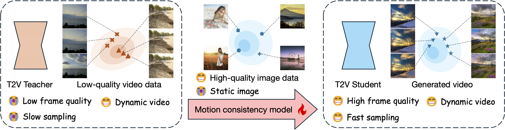

# [🚀 Motion Consistency Model: Accelerating Video Diffusion with Disentangled Motion-Appearance Distillation](https://yhzhai.github.io/mcm/)

<a href='https://yhzhai.github.io/mcm/'></a> <a href='https://arxiv.org/abs/2406.06890'></a> <a href='https://huggingface.co/yhzhai/mcm'></a> <a href='https://huggingface.co/spaces/yhzhai/mcm'></a> [](https://colab.research.google.com/drive/1ouGbIZA5092hF9ZMHO-AchCr_L3algTL?usp=sharing)

[Yuanhao Zhai](https://www.yhzhai.com/)<sup>1</sup>, [Kevin Lin](https://sites.google.com/site/kevinlin311tw/)<sup>2</sup>, [Zhengyuan Yang](https://zyang-ur.github.io)<sup>2</sup>, [Linjie Li](https://scholar.google.com/citations?hl=en&user=WR875gYAAAAJ)<sup>2</sup>, [Jianfeng Wang](http://jianfengwang.me)<sup>2</sup>, [Chung-Ching Lin](https://scholar.google.com/citations?hl=en&user=legkbM0AAAAJ)<sup>2</sup>, [David Doermann](https://cse.buffalo.edu/~doermann/)<sup>1</sup>, [Junsong Yuan](https://cse.buffalo.edu/~jsyuan/)<sup>1</sup>, [Lijuan Wang](https://scholar.google.com/citations?hl=en&user=cDcWXuIAAAAJ)<sup>2</sup>

**<sup>1</sup>State University of New Yort at Buffalo  &nbsp; | &nbsp;  <sup>2</sup>Microsoft**

**TL;DR**: Our motion consistency model not only accelerates text2video diffusion model sampling process, but also can benefit from an additional high-quality image dataset to improve the frame quality of generated videos.



<!-- **All training, inference, and evaluation code, as well as model checkpoints will be released in the coming two weeks. Please stay tuned!** -->

## 🔥 News

**[06/2024]** Our MCM achieves strong performance (using 4 sampling steps) on the [ChronoMagic-Bench](https://pku-yuangroup.github.io/ChronoMagic-Bench/)! Check out the leaderboard [here](https://huggingface.co/spaces/BestWishYsh/ChronoMagic-Bench).

**[06/2024]** Training code, [pre-trained checkpoint](https://huggingface.co/yhzhai/mcm), [Gradio demo](https://huggingface.co/spaces/yhzhai/mcm), and [Colab demo](https://colab.research.google.com/drive/1ouGbIZA5092hF9ZMHO-AchCr_L3algTL?usp=sharing) release.

**[06/2024]** [Paper](https://arxiv.org/abs/2406.06890) and [project page](https://yhzhai.github.io/mcm/) release.

## Contents

  - [Getting started](#-getting-started-)
    - [Environment setup](#environment-setup-)
    - [Data preparation](#data-preparation-)
    - [DINOv2 and CLIP checkpoint download](#download)
    - [Wandb integration](#wandb-)
  - [Training](#training-)
  - [Inference](#inference-)
  - [MCM weights](#mcm-weights-)
  - [Acknowledgement](#acknowledgement-)
  - [Citation](#citation-)

## Getting started <a name="getting-started"></a>

### Environment setup <a name="env-setup"></a>

Instead of installing [diffusers](https://github.com/huggingface/diffusers), [peft](https://github.com/huggingface/peft), and [open_clip](https://github.com/mlfoundations/open_clip) from the official repos, we use our modified versions specified in the requirements.txt file.
This is particularly important for diffusers and open_clip, due to the former's current limited support for video diffusion model LoRA loading, and the latter's distributed training dependency.

To set up the environment, run the following commands:

```shell
pip install torch==2.1.2 torchvision==0.16.2 torchaudio==2.1.2 --index-url https://download.pytorch.org/whl/cu118  # please modify the cuda version according to your env 
pip install -r requirements.txt
pip install scipy==1.11.1
pip install https://github.com/podgorskiy/dnnlib/releases/download/0.0.1/dnnlib-0.0.1-py3-none-any.whl
```


### Data preparation <a name="data"></a>

Please preparation the video and optional image datasets in the [webdataset](https://github.com/webdataset/webdataset) format.

Specifically, please wrap the video/image files and their corresponding .json format metadata into .tar files.
Here is an example structure of the video .tar file:

```
.
├── video_0.json
├── video_0.mp4
...
├── video_n.json
└── video_n.mp4
```

The .json files contain video/image captions in key-value pairs, for example: `{"caption": "World map in gray - world map with animated circles and binary numbers"}`.

We provide our generated anime, realistic, and 3D cartoon style image datasets here (coming soom).
Due to dataset agreement, we could not publicly release the WebVid and LAION-aes dataset.

### DINOv2 and CLIP checkpoint download <a name="download"></a>

We provide a script `scripts/download.py` to download the DINOv2 and CLIP checkpoint.

```shell
python scripts/download.py
```

### Wandb integration <a name="wandb"></a>

Please input your wandb API key in `utils/wandb.py` to enable wandb logging.
If you do not use wandb, please remove `wandb` from the `--report_to` argument in the training command.


## Training <a name="train"></a>


We leverage [accelerate](https://github.com/huggingface/accelerate) for distributed training, and we support two different based text2video diffusion models: [ModelScopeT2V](https://arxiv.org/abs/2308.06571) and [AnimateDiff](https://arxiv.org/abs/2307.04725). For both models, we train LoRA instead fine-tuning all parameters.

### ModelScopeT2V

For ModelScopeT2V, our code supports pure video diffusion distillation training, and frame quality improvement training.

By default, the training script requires 8 GPUs, each with 80GB of GPU memory, to fit a batch size of 4. The minimal GPU memory requirement is 32GB for a batch size of 1. Please adjust the `--train_batch_size` argument accordingly for different GPU memory sizes.

Before running the scripts, please modify the data path in the environment variables defined at the top of each script.

**Diffusion distillation**

We provide the training script in `scripts/modelscopet2v_distillation.sh`

```shell
bash scripts/modelscopet2v_distillation.sh
```

**Frame quality improvement**

We provide the training script in `scripts/modelscopet2v_improvement.sh`. Before running, please assign the `IMAGE_DATA_PATH` in the script.

```shell
bash scripts/modelscopet2v_improvement.sh
```

### AnimateDiff

Due to the higher resolution requirement, MCM with AnimateDiff base model training requires at least 70GB of GPU memory to fit a single batch.

We provide the diffusion distillation training script in `scripts/animatediff_distillation.sh`.

```shell
bash scripts/animatediff_distillation.sh
```

## Inference <a name="infer"></a>

We provide our pre-trained checkpoint [here](https://huggingface.co/yhzhai/mcm), Gradio demo [here](https://huggingface.co/spaces/yhzhai/mcm), and Colab demo [here](https://colab.research.google.com/drive/1ouGbIZA5092hF9ZMHO-AchCr_L3algTL?usp=sharing). `demo.py` showcases how to run our MCM in local machine.
Feel free to try out our MCM!

## MCM weights <a name="weight"></a>

We provide our pre-trained checkpoint [here](https://huggingface.co/yhzhai/mcm).

## Acknowledgement <a name="ack"></a>

Some of our implementations are borrowed from the great repos below.

1. [Diffusers](https://github.com/huggingface/diffusers)
2. [StyleGAN-T](https://github.com/autonomousvision/stylegan-t)
3. [GMFlow](https://github.com/haofeixu/gmflow)

## Citation <a name="cite"></a>

```
@article{zhai2024motion,
  title={Motion Consistency Model: Accelerating Video Diffusion with Disentangled
  Motion-Appearance Distillation},
  author={Zhai, Yuanhao and Lin, Kevin and Yang, Zhengyuan and Li, Linjie and Wang, Jianfeng and Lin, Chung-Ching and Doermann, David and Yuan, Junsong and Wang, Lijuan},
  year={2024},
  journal={arXiv preprint arXiv:2406.06890},
  website={https://yhzhai.github.io/mcm/},
}
```
